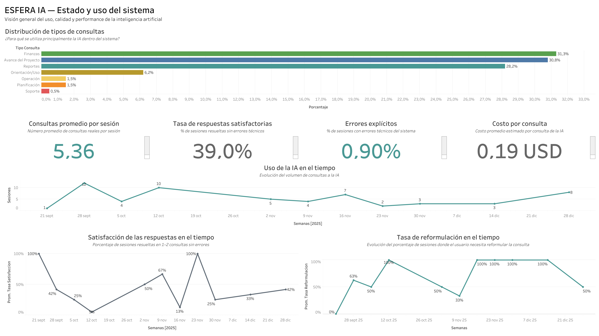
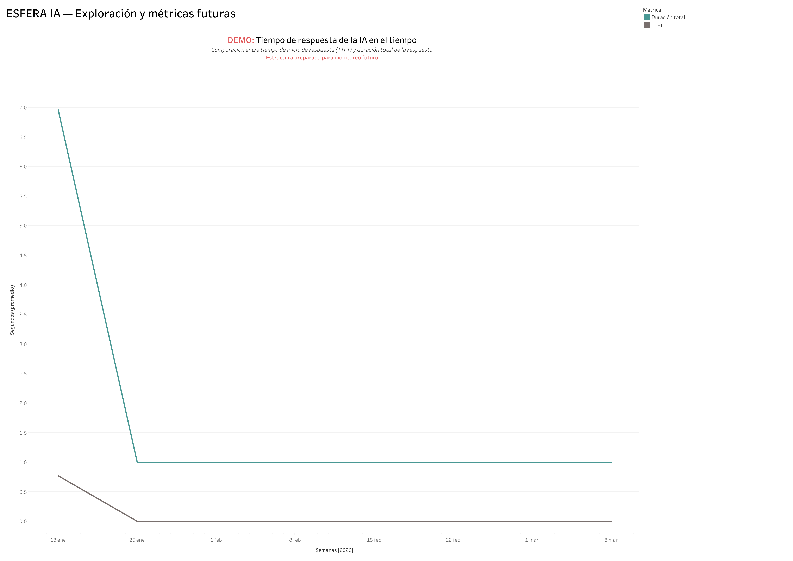

# Esfera AI Monitoring Framework

End-to-end analytical framework designed to operationalize AI monitoring inside enterprise software.  
Transforms raw conversational logs into measurable business, technical, and cost-performance indicators.

---

## 📄 Presentation

Full executive case study available here:

> [View the full case study (PDF)](presentation/esfera_ai_monitoring_case_study.pdf)

---

## 🎯 Project Overview

This project transforms raw AI interaction logs into a structured analytical model capable of measuring:

- AI usage patterns  
- Query complexity and behavioral friction  
- Response quality proxies  
- Technical performance (TTFT & total duration)  
- Operational cost per interaction  
- Reformulation behavior  
- Explicit technical error rates  

The objective was to build a reproducible KPI structure enabling long-term monitoring, executive dashboards, and scalable performance governance.

---

## 🏢 Business Context

Esfera is a construction management software platform integrating a conversational AI assistant.

Users interact with the AI to:

- Analyze financial data  
- Track project progress  
- Generate operational reports  
- Interpret system information  

The system required a structured analytical framework to evaluate adoption, performance quality, technical stability, and scalability readiness.

---

## 🌎 Language Context

The original system logs and production queries were written in Spanish, as the software operates in a Spanish-speaking business environment.

For portfolio and documentation purposes, the analytical framework, KPI definitions, SQL logic, and strategic interpretation were standardized in English.

This preserves real implementation conditions while ensuring international professional clarity.

---

## 🛠 Methodology

The framework includes:

- Sessionization logic based on a 10-minute inactivity threshold  
- Real-query filtering (exclusion of greetings and trivial messages)  
- Heuristic query classification (keyword-based logic)  
- Behavioral KPI definitions  
- Token-based cost estimation model  
- Performance baseline metrics (TTFT & total duration)  

All KPIs are fully reproducible using SQL (BigQuery).

---

## 📊 Core KPIs Defined

1. Satisfactory Response Rate  
2. Reformulation Rate  
3. Average Queries per Session  
4. Explicit Error Rate  
5. AI Response Time (TTFT & Duration)  
6. Cost per Query (USD)

These KPIs establish a behavioral, technical, and operational baseline for AI performance monitoring.

---

## 📈 Dashboard Implementation

The defined KPIs were operationalized into Tableau dashboards for executive and technical monitoring.

### Executive Monitoring Dashboard

**Focus:**
- Usage distribution  
- Quality indicators  
- Friction patterns  
- Cost baseline  

**Business Value:**
- Supports product prioritization  
- Enables leadership-level AI adoption tracking  
- Identifies user friction signals  

---

### Technical Performance Dashboard

**Focus:**
- TTFT (Time to First Token)  
- Total response duration  
- Performance baselines  
- Trend analysis structure  

**Business Value:**
- Detects latency degradation  
- Enables infrastructure performance tracking  
- Prepares alert threshold design  

> Note: Dashboard visuals remain in Spanish to reflect the real production environment of the enterprise implementation.

---

## 🧩 Repository Structure

- `/notebooks` → Full analytical notebook (Kaggle version)  
- `/sql` → Production-ready KPI SQL queries  
- `/dashboard` → Dashboard documentation and visuals  
- `/presentation` → Executive case study (PDF)  

---

## 🚀 Outcome

The project delivers a scalable monitoring architecture that enables:

- Evidence-based product decisions  
- Performance baseline tracking  
- Operational cost visibility  
- Longitudinal AI evolution monitoring  

This framework can evolve into a live enterprise monitoring layer as AI usage scales.

---

## Author

Tahani Rubert  
Data Analyst | AI Monitoring & Performance Analytics
